# Struck – Permit-Free Zoning Assessment

This repository evaluates whether a resident’s building plan is **Permit-Free (Vergunningsvrij)** at specific Dutch addresses, based on the applicable zoning regulations provided in JSON files.

## Problem Summary

Resident plan:

- **Outbuilding / bijbehorend bouwwerk**
- **20 m²**, **3 m high**
- Used as **Living Space (verblijfsgebied)** and subordinate to the main house

Legal nuance:
Outbuildings are often only permit-free when used for storage/hobby. Using them as **living space** can trigger permitting requirements. The system explicitly checks this.

Rules implemented:

- Ignore temporary parts
- Ignore any document with **"Parapluplan"** in the title
- Only consider documents of type **Bestemmingsplan** and **Omgevingsplan**
- A plan is permit-free **only if explicitly stated** in the regulations (e.g. “vergunningsvrij”, “zonder omgevingsvergunning”, “is niet van toepassing”)

## Approach

RAG-style pipeline:

1. **Ingestion & Validation**
   - Load each address JSON
   - Validate schema with **Pydantic** to ensure data integrity

2. **Document Filtering**
   - Exclude Parapluplans (title contains “Parapluplan”)
   - Keep only Bestemmingsplan + Omgevingsplan

3. **Parsing**
   - Parse each document’s Markdown into **article-level chunks**
   - Each chunk includes: doc title/id/date + article number + text

4. **Context Window Optimization (Retrieval)**
   - Use a deterministic lexical retriever:
     - Boost chunks referencing applicable **bestemmingsvlakken**
     - Boost chunks containing explicit **permit-free** language
     - Force-include chunks mentioning **verblijfsgebied / woonfunctie**
   - Assemble top chunks under a token budget

5. **LLM Analysis with Structured Output**
   - Call the LLM with rules:
     - “Yes” only if explicitly permit-free
     - Must check living space nuance explicitly
   - Output is validated into a Pydantic model (`ZoningAssessment`)

6. **Guardrails**
   - If the model returns “Yes” but the retrieved context contains no explicit permit-free signal, downgrade to “Conditional”.

## Assumptions

1. Only a legally built house exists at each address (no other existing buildings)
2. Plot is large enough to physically accommodate the outbuilding
3. Temporary parts can be ignored
4. Bestemmingsvlakken regulate usage and development
5. Only Bestemmingsplan + Omgevingsplan are considered; Parapluplans are ignored
6. Permit-free only if explicitly stated (allowed ≠ permit-free)

## Setup

Create and activate a virtual environment, install dependencies:

```bash
pip install -r requirements.txt
```

Set your OpenAI API key:

```bash
export OPENAI_API_KEY="..."
```

or create a .env file:

```bash
OPENAI_API_KEY=...
```

Place zoning JSON files in data/.

## Run

Analyze all JSON files in data/:

```bash
python src/main.py --data-dir data
```

Increase context size (if needed):

```bash
python src/main.py --data-dir data --max-context-tokens 14000 --max-chunks 60
```

Print raw JSON output:

```bash
python src/main.py --data-dir data --output-json
```

## Output

Per address, the program prints:

- Decision: Yes / No / Conditional
- Summary (short reasoning)
- Suggested changes (optional)
- Missing information (if Conditional)
- Risk flags
- Evidence list (doc + article + excerpt)

## Results

### 1. Dennenweg 4, Vaassen

- Address: Dennenweg 4, 8172AJ Vaassen
- Bestemmingsvlakken: ['Waarde - Archeologie', 'Tuin', 'Wonen']
- Documents considered: 2 (after Parapluplan/type filtering)
- Retrieved context size: 30760 chars
- Decision (permit-free): No
- Summary: The plan involves using an outbuilding as living space, which is not explicitly stated as permit-free in the provided excerpts. Therefore, a permit is required.
- Risk flags:
  - Living space in outbuilding is high-risk
- Evidence:
  - Omgevingsplan gemeente Epe | Artikel 22.27: Het verbod, bedoeld in artikel 22.26, geldt niet voor de activiteiten, bedoeld in dat artikel, als die betrekking hebben op een van de volgende bouwwerken: a. een bijbehorend bouwwerk... (This article lists exceptions to permit requirements but does not explicitly state that living space in an outbuilding is permit-free.)

### 2. Johannes Verhulststraat 85-2, Amsterdam

- Address: Johannes Verhulststraat 85-2, 1071MV Amsterdam
- Bestemmingsvlakken: ['Waarde - Cultuurhistorie 3', 'Waarde - Landschap 1', 'Wonen', 'Tuin - 1']
- Documents considered: 8 (after Parapluplan/type filtering)
- Retrieved context size: 9022 chars
- Decision (permit-free): No
- Summary: The plan involves using an outbuilding as living space, which is not explicitly stated as permit-free in the provided excerpts. The rules mention permit-free conditions for outbuildings but do not explicitly allow living space use without a permit.
- Suggested changes: Consider applying for a permit or modifying the use of the outbuilding to non-living purposes to potentially qualify for permit-free status.
- Risk flags:
  - Living space use in outbuildings often requires permits unless explicitly stated as permit-free.
  - Living space in outbuilding is high-risk
- Evidence:
  - Omgevingsplan gemeente Amsterdam | Artikel 4.12: Het verbod, bedoeld in artikel 4.7, geldt niet voor een omgevingsplanactiviteit bouwwerken als die activiteit betrekking heeft op: a. een bijbehorend bouwwerk... (This article lists conditions under which outbuildings are permit-free, but does not explicitly mention living space use.)
  - Omgevingsplan gemeente Amsterdam | Artikel 5.8: een bijbehorend bouwwerk of een uitbreiding daarvan als voldaan wordt aan de volgende eisen:... de ligging van een verblijfsgebied, bij meer dan een bouwlaag, alleen op de eerste bouwlaag; (This article allows outbuildings with certain conditions but does not explicitly state permit-free status for living space use.)

### 3. v.Wassenaar v.Obdamstr. 1, Ommen

- Address: v.Wassenaar v.Obdamstr. 1, 7731BR Ommen
- Bestemmingsvlakken: ['Waarde - Archeologische verwachtingswaarde', 'Waterstaat - Waterkering', 'Woongebied']
- Documents considered: 3 (after Parapluplan/type filtering)
- Retrieved context size: 29286 chars
- Decision (permit-free): Conditional
  - m0175/2020/omgevingsplan | Artikel 22.27: Het verbod, bedoeld in artikel 22.26, geldt niet voor... een bijbehorend bouwwerk... als wordt voldaan aan de volgende eisen: op de grond staand; gelegen in achtererfgebied;... niet hoger dan 5 m;... (This article lists conditions under which an outbuilding can be permit-free, including height and location requirements.)

## Scaling & Future Challenges

To scale this system to millions of addresses and multiple jurisdictions, this pipeline was designed with modular decoupling:

- Terms like `vergunningsvrij` would be moved to a YAML configuration layer per country/language.
- Legal documents vary in format. The `MarkdownParser` is an interface. For other jurisdictions, a `PDFParser` or `DOCXParser` would be created that outputs the same `LegalChunk` format.
- The system functions as a filter that highlights risks and evidence for a human expert.

## System Architecture

```mermaid
flowchart LR
  Plan([Resident Plan]) --> M
  Data[(Zoning JSON)] --> M

  M[main.py: CLI Orchestrator] --> L1

  subgraph ING["Ingestion"]
    direction TB
    L1[Pydantic Validation]
    L2[Document Filtering]
    L1 --> L2
  end

  L2 --> P1

  subgraph PAR["Parsing"]
    direction TB
    P1[Article Chunking]
    P2[Metadata Handling]
    P1 --> P2
  end

  P2 --> R1

  subgraph RET["Retrieval"]
    direction TB
    R1[Heuristic Scoring]
    R2[Token Budgeting]
    R1 --> R2
  end

  R2 --> C1

  subgraph AI["Reasoning"]
    direction TB
    C1[Structured LLM]
    C2[Safety Guardrail]
    C1 --> C2
  end

  C2 --> Out[/Final Assessment/]

  classDef node fill:#ffffff,stroke:#333333,color:#000000;
  classDef group fill:#f4f4f4,stroke:#999999,color:#000000;

  class Plan,Data,M,Out node;
  class L1,L2,P1,P2,R1,R2,C1,C2 node;

  style ING fill:#f4f4f4,stroke:#999999,color:#000000
  style PAR fill:#f4f4f4,stroke:#999999,color:#000000
  style RET fill:#f4f4f4,stroke:#999999,color:#000000
  style AI  fill:#f4f4f4,stroke:#999999,color:#000000
```

